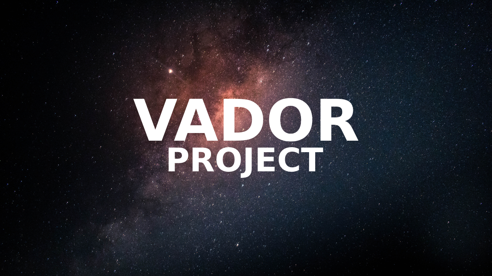

# Vador Project

## Welcome

**Vador Project** is a free and open-source project that compiles a list of various free and open-source software directly from their official websites.

## How it works

Simply visit [our website](https://enioaiello.github.io/vador) and start browsing through the listed software!

## License

Vador Project is licensed under the [MIT License](LICENSE).

## Support

For any inquiries or support requests, please contact us at [aielloenio@icloud.com](mailto:aielloenio@icloud.com).

## Acknowledgements

Special thanks to **ChatGPT** for the invaluable assistance provided in developing the site and curating the software list.

